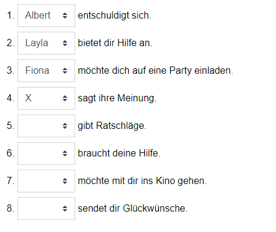
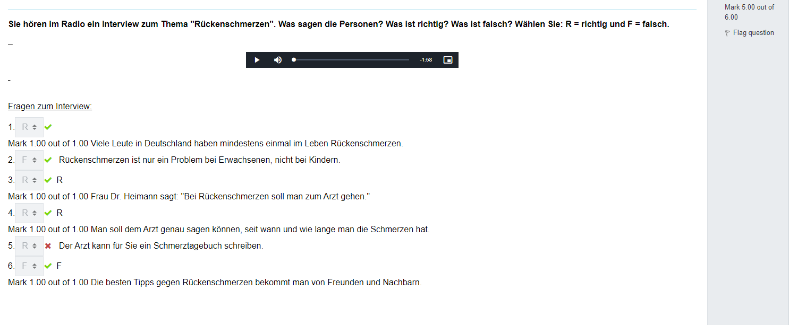

## Sie waren den ganzen Tag an der Uni. Zu Hause sehen Sie viele Nachrichten auf Ihrem Smartphone. Lesen Sie die Nachrichten. Was wollen Ihre Mitstudenten? 

Wer will was? Ordnen Sie zu.
ACHTUNG: Zu einem Item passt keine Nachricht. Wählen Sie das "X"

----------

## Sie müssen im Deutschkurs eine Präsentation über eine Person aus einem deutschsprachigen Land machen. Sie möchten eine Präsentation über Rorger Federer machen und sammeln Informationen. Lesen Sie den Text. Was ist richtig? Was ist falsch? Was steht nicht im Text? Wählen Sie: R = richtig, F = falsch oder N = steht nicht im Text.

---------
## Sie sind an der Uni und hatten eine Vorlesung. Nach der Vorlesung sehen Sie drei Voice-Nachrichten auf Ihrem Smartphon. Hören Sie sich die Nachrichten an. Was ist richtig? Wählen Sie: A, B oder C.

-----------

---------

-----------

----------

`lustig -> lustigen`

----------

dort, 
wandem,
gebucht, 
dem,
der,
Flughafen, 
als,
denke,
Woche, 
Bahnhof,
wartet, 
Aufzug,
dritten, 
Internetverbindung, 
gefällt

